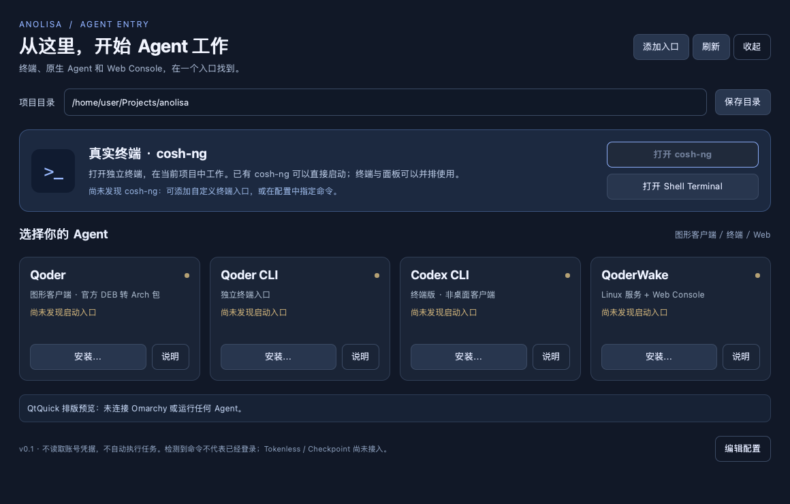

# ANOLISA Agent Entry · Omarchy 原型

[English](README.md)

本目录是独立实验原型，不属于 ANOLISA 的默认安装、统一构建或正式发行清单。当前界面为中文。

一个 Omarchy 插件：**顶栏入口 + Agent Dashboard + 真实终端启动**。



采用 Quickshell/QML 写界面，一个 Python 脚本负责按钮动作。不需要 C++ 编译，不启动自有后台服务，也没有另造 Agent、账号系统或包管理器。

## 现在能做什么

- 顶栏点击「Agent 入口」打开/收起 Dashboard；可选择登录桌面后自动显示。
- 打开真实 Shell Terminal，或启动机器上已有的 cosh-ng；终端是独立窗口，可与 Dashboard 平铺。
- 一排 Qoder、Qoder CLI、Codex CLI、QoderWake 按钮；找到本机启动命令后调用原生程序。
- Qoder CLI、Codex CLI、QoderWake 的安装按钮打开终端，展示来源并要求输入 INSTALL 确认后执行安装。
- Qoder GUI 的安装按钮将官方 DEB 转成本地 pacman 包；下载 URL 在 `qoder/qoder.conf`，仓库不存放第三方二进制包。
- 添加自定义终端、图形程序或 Web 入口；选择项目目录。
- 各 Agent 在自己的原生界面完成登录，不在 Dashboard 中收集或保存凭据。

**Qoder GUI 已增加实验性的 x86_64 安装器。**「安装…」调用下方独立转换脚本，保留官方程序、图标及 `qoder:` / `qoder-app:` 回调，不执行 DEB 的安装脚本。Linux 实机安装、sandbox 启动和浏览器登录仍需验收。这里安装的是新版 Qoder GUI，不是 Qoder IDE 或 QoderWork。

本版不是嵌入式终端、统一聊天客户端或任务看板；没有伪造 Tokenless、Checkpoint 等运行数据。收起面板不会主动结束已启动的终端和 Agent；机器关机、退出桌面会话后继续运行不属于本版能力。

## 编译与部署

目标：**Omarchy 4.0.1 的 Quickshell 插件系统**。在目标 Omarchy 的桌面终端内、以普通用户运行，不要 sudo。已有桌面应提供 `omarchy`、`omarchy-shell`、`qs`、`python3`、`jq`、`xdg-open` 和 foot/kitty 等终端。Codex CLI 安装另外需要 npm。

在已检出的本分支仓库根目录执行：

```bash
cd experiments/omarchy-agent-entry
python3 install.py --autostart
```

**不需要编译。** 安装器会验证 manifest、复制 QML/脚本、启用插件并打开 Dashboard。它不会安装 Agent、不修改系统包源，也不会覆盖 Hyprland 配置。

不希望自动显示时，安装命令去掉 `--autostart`。这个选项使用 Omarchy 的 `post-boot.d` 独立钩子，不在启动时自动运行 Agent 或任务。

安装路径：

| 内容 | 位置 |
|---|---|
| 插件 | `~/.config/omarchy/plugins/anolisa.agent-entry/` |
| 命令入口 | `~/.local/bin/anolisa-agent-entry` |
| 应用菜单入口 | `~/.local/share/applications/anolisa-agent-entry.desktop` |
| 可选自启动钩子 | `~/.config/omarchy/hooks/post-boot.d/anolisa-agent-entry.sh` |
| 项目及自定义入口配置 | `~/.config/anolisa/agent-entry.json` |

## 第一次使用

1. 点「打开 Shell Terminal」，确认原生终端可用。已有 cosh-ng 会显示可打开；本包不包含 cosh-ng。
2. 点 Qoder GUI / Qoder CLI / Codex CLI / QoderWake 的「安装…」，在终端确认来源，再输入 INSTALL。网络和账号条件由目标机器提供。
3. 安装结束后点「刷新」，再点「打开」，在原生界面完成登录。
4. Qoder GUI 使用下方转换器。已有安装但未被识别时，用配置指定命令。
5. QoderWake 由按钮显式启动；脚本调用 `whoami`，必要时进入原生 `login`，然后 `start --host 127.0.0.1 --open`。默认只监听本机，不自动对公网开放。

### 在 Omarchy / Arch 安装 Qoder GUI

在本实验目录中，以桌面普通用户运行。依赖用 pacman 安装；转换器本身**不要 sudo**：

```bash
sudo pacman -S --needed base-devel curl libarchive zstd python
python3 qoder/install.py
```

Dashboard 的 Qoder「安装…」按钮在终端调用同一个脚本。核对 URL，输入 `INSTALL`，再确认 pacman 的依赖和安装事务。脚本下载 DEB、读取版本与架构、用 makepkg 生成 `anolisa-qoder-bin`，然后执行 `sudo pacman -U`。这是二进制重新打包，不重新编译 Qoder，也不添加系统包源。

**下载 URL 和可选 SHA256 固定值在 `qoder/qoder.conf`。** 插件部署后的副本位于 `~/.config/omarchy/plugins/anolisa.agent-entry/qoder/qoder.conf`。配置按 INI 数据读取，不作为 Shell 执行。下载只用 HTTPS，默认 URL 指向官方滚动 `latest`；计算出的 hash 只是本地完整性记录，不是官方签名。需要固定版本时，填写核验过的官方 URL 和可信 SHA256。插件升级会备份旧 conf，升级后需重新应用自定义配置。

```bash
# 按 conf 中的 URL 下载、打包，不提权、不安装：
python3 qoder/install.py --build-only
# 或使用自行从官网下载的 DEB：
python3 qoder/install.py --build-only --deb /path/to/Qoder-linux-amd64.deb
# 也可以指定另一份配置：
python3 qoder/install.py --conf /path/to/qoder.conf
# 启动 GUI，命令与 Qoder CLI 分开：
qoder-desktop
# 更新时重新运行转换器；卸载转换后的程序：
sudo pacman -R anolisa-qoder-bin
```

下载、构建产物和版本/hash 记录只放在仓库外的 `${XDG_CACHE_HOME:-~/.cache}/anolisa-agent-entry/qoder/build-*`。请预留数 GB 空间，容纳下载包、两份展开内容和最终包。多次构建分别留存缓存，方便排查或回退，不自动清理。非 x86_64、包身份不符或固定 hash 不符时拒绝继续；安装文件由 pacman 管理，遇到文件冲突会报错，不强制覆盖。

Electron 使用非特权 user namespace sandbox，安装前会检查。转换器不禁用 sandbox、不启用 setuid，也不修改 AppArmor 策略；加固系统如禁止 namespace，需要管理员评估，不能以 `--no-sandbox` 绕过。`--build-only` 不检查目标机的 sandbox，部署时需另验。运行依赖由 pacman 安装，不运行 DEB 的安装脚本。

浏览器登录依赖 `qoder.desktop` 的两种 URL 回调。如果旧安装占用了回调，先查看注册情况：

```bash
xdg-mime query default x-scheme-handler/qoder
xdg-mime query default x-scheme-handler/qoder-app
# 仅在确认要把回调交给这个 Qoder GUI 时执行：
xdg-mime default qoder.desktop x-scheme-handler/qoder
xdg-mime default qoder.desktop x-scheme-handler/qoder-app
```

后续升级也用转换器，避免在这个包上运行官方 DEB/RPM 更新器而使 pacman 清单失真。卸载 Dashboard 不卸载 Qoder；卸载 Qoder 不删除其用户账号数据。

### 指定 cosh-ng 或 Qoder 命令

Dashboard 的「添加入口」可以直接注册，也可点击「编辑配置」。内置入口覆盖示例（路径换成目标机真实路径；合并到已有配置，不要覆盖其他入口）：

```json
{
  "version": 1,
  "project": "/home/yourname/Projects",
  "commands": {
    "cosh": ["/opt/anolisa/bin/cosh-ng"],
    "qoder": ["/opt/Qoder/qoder"]
  },
  "agents": []
}
```

CLI 注册同样可用：

```bash
~/.local/bin/anolisa-agent-entry register my-cosh "我的 cosh" terminal '["/opt/anolisa/bin/cosh-ng"]'
~/.local/bin/anolisa-agent-entry register console "我的 Web Console" web 'http://127.0.0.1:19820'
```

这是**入口注册**，不涉及 MCP 服务注册或 Agent 账号注册。命令使用参数数组直接执行，不拼接 Shell。需要环境初始化时，先写自己的启动脚本，再注册脚本路径。

Qoder GUI 与 CLI 分开检测，不用同名 `qoder` 命令猜测 GUI。GUI 经 `gtk-launch` 启动时由应用自身决定是否恢复旧项目；项目目录用于终端的工作目录，不宣称所有 GUI 都支持统一项目参数。

## 调试、升级和卸载

```bash
~/.local/bin/anolisa-agent-entry status
~/.local/bin/anolisa-agent-entry open
~/.local/bin/anolisa-agent-entry launch terminal
omarchy-shell shell listPlugins
omarchy-shell shell rescanPlugins
```

顶栏入口缺失，先检查插件是否启用：

```bash
omarchy plugin enable anolisa.agent-entry
omarchy-shell shell summon anolisa.agent-entry '{}'
```

界面未加载时，用 `qs log --help` 查看当前版本的日志选项；插件依附 Omarchy 的 Shell 实例，不要为测试另启动第二套整个 Omarchy Shell。启动命令存在但应用立即退出时，在终端执行其真实命令观察报错；本版不把“启动入口存在”当作应用健康检测。

升级：

```bash
python3 install.py --replace --autostart
```

卸载：

```bash
python3 install.py --uninstall
```

升级/卸载的旧插件文件移到 `~/.config/anolisa/plugin-backups/`，可恢复；Agent 本体、账号和入口配置保留。只关自动显示，可把上面的独立自启动钩子移出 `post-boot.d/`。安装器没有联网更新功能。

## 验证范围

已用 Omarchy **v4.0.1** 的官方 manifest 校验脚本验证结构，并用 Python 单元测试及真正的 QtQuick 渲染检查界面。QtQuick 测试包含终端按钮信号、注册弹窗与窗口尺寸变化。

**尚未在 Linux/Hyprland/Omarchy 实机完成联调**；开发机为 macOS。因此顶栏实际加载、桌面启动钩子、各 Agent 登录和安装后的实际运行，需要在目标机验收。预览图仅是本插件 QML 的排版渲染，不是已部署 Omarchy 的截图。

Qoder 转换器已测试配置、包身份、版本解析及目录布局，并用官方 `1:0.2.5` amd64 DEB 实际执行了提取和打包目录生成；开发机没有 makepkg/pacman，不能据此视为实机安装通过。

```bash
python3 -m unittest discover -s tests -v
python3 -m pytest tests/test_*.py
omarchy plugin validate .
```

可选界面测试（开发环境另外安装 PySide6；部署不需要）：

```bash
QT_QPA_PLATFORM=offscreen python3 tests/render_qml.py /tmp/agent-entry-preview.png
```

目标机最小验收：顶栏打开/收起 → 独立终端 → 注册一个真实命令 → 安装并登录一个 CLI Agent → 关闭 Dashboard 后终端仍在 → 重新登录验证自动显示。

Qoder GUI 验收：安装 → `pacman -Q anolisa-qoder-bin` → `qoder-desktop` → 浏览器登录并回到 GUI → 打开项目 → 从 Dashboard 启动。

## 改哪里

- `DashboardContent.qml`：界面、按钮和注册弹窗。
- `Dashboard.qml`：Omarchy 中的窗口与短进程调用。
- `BarWidget.qml`：顶栏按钮。
- `agent_entry.py`：启动、安装、配置；可脱离面板单独调用。
- `install.py`：把插件放入 Omarchy 并启用。
- `qoder/install.py`、`qoder/PKGBUILD`、`qoder/qoder.conf`：独立的官方 DEB 转换脚本、Arch 打包配方和下载配置。

通用 UI 使用 QtQuick；manifest、顶栏挂载和 Shell IPC 使用 Omarchy 插件协议。可以复用到其他 Quickshell 环境，但不能直接宣称已经兼容任意 Quickshell Shell。

## 核验来源（2026-09-16）

- [Omarchy v4.0.1 Shell 插件说明](https://github.com/omacom/omarchy/blob/v4.0.1/shell/README.md)，源码 commit `13f18b2cb7286fb54f87daf571a031aa6af3d8f0`。
- [Omarchy 插件开发](https://plugins.omarchy.org/develop.html)、[Shell Plugins 手册](https://omarchy.org/manual/shell-plugins/)。
- [Quickshell FloatingWindow](https://quickshell.org/docs/v0.3.0/types/Quickshell/FloatingWindow/)、[Process](https://quickshell.org/docs/v0.3.0/types/Quickshell.Io/Process/)。
- [Qoder 下载](https://qoder.com/download)、[CLI 安装](https://docs.qoder.com/cli/installation)、[QoderWake CLI](https://docs.qoder.com/qoderwake/cli-reference)。
- [Codex CLI 官方仓库](https://github.com/openai/codex)。

只分发我方插件源文件，不捆绑 Qoder/Codex/其他第三方 Agent 的二进制；沿用仓库根目录的 Apache-2.0 许可证。该实验没有注册到 ANOLISA 安装器；在完成目标机验证和组件接入流程之前，不使用正式组件的安装命令。
